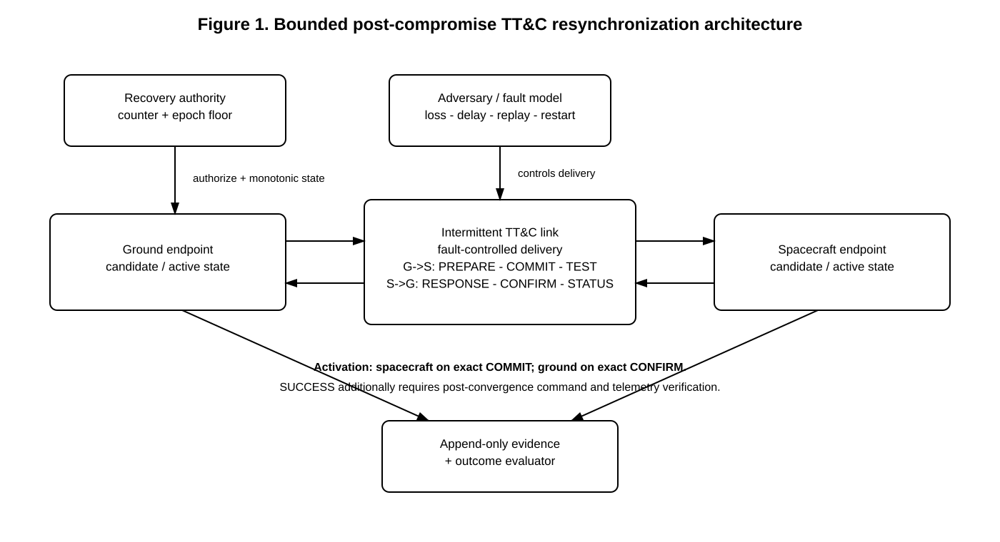
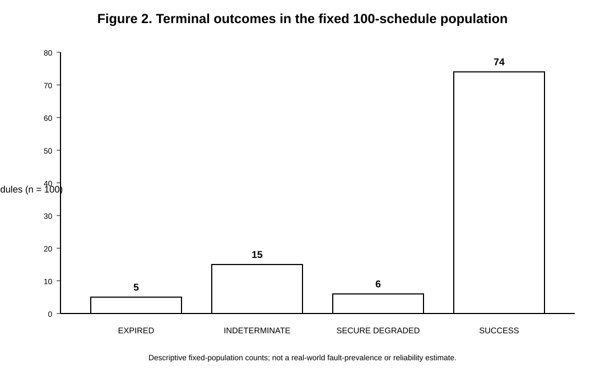
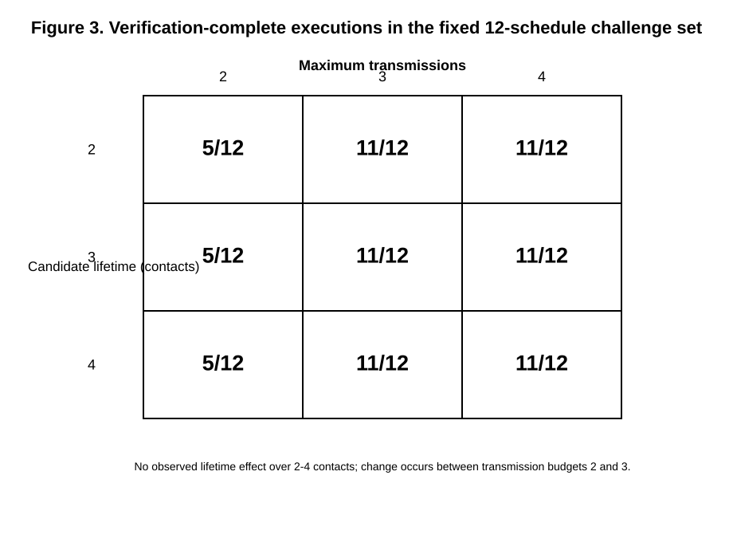

# Post-Compromise Satellite TT&C Resynchronization Under Intermittent Links: A Controlled Fault-Injection Study

## Abstract

Fresh key establishment does not by itself restore trusted telemetry, tracking, and command (TT&C) operation after compromise when intermittent contact, message loss, and endpoint state loss can leave ground and spacecraft on different recovery states. We study this operational resynchronization problem in a deterministic software model containing three project-defined baseline abstractions and a bounded resynchronization controller (T1). The final experiment was predeclared and retained without outcome-driven reruns. It includes four qualified matched families, 40 deterministic T1 schedules, a fixed 100-schedule mixed-fault population, a 3 x 3 sensitivity grid totaling 108 executions, and bounded TLA+/Python trace comparisons. The matched families showed categorical parity rather than treatment superiority. Across 31 canonical deterministic fault cells, 25 terminated successfully, four were indeterminate because post-convergence command or telemetry evidence was missing, one expired after spacecraft-state loss at COMMIT, and one produced an unsafe spacecraft-ahead state after restart at CONFIRM. Single message drops and contact closures during the recovery exchange were absorbed within the retry budget, whereas additional retransmissions could not repair destroyed endpoint protocol state. In the fixed challenge set, increasing the maximum transmission budget from two to three increased verification-complete executions from 5/12 to 11/12; a fourth transmission and candidate lifetimes from two through four contacts produced no additional observed benefit. The mixed-schedule population produced 74 successful terminations, but only 77 of 191 scheduled fault actions were reached at runtime, so those counts are descriptive rather than reliability estimates. The results support separating candidate state, activation, verification evidence, and persistent recovery state when designing post-compromise TT&C recovery.

**Keywords:** satellite cybersecurity; telemetry, tracking, and command (TT&C); post-compromise recovery; key management; resynchronization; fault injection; Space Data Link Security (SDLS); formal methods

---

## 1. Introduction

Telemetry, tracking, and command (TT&C) links form the operational control path between a
spacecraft and its authorized ground segment. Loss of confidence in the cryptographic state of
that path is therefore not merely a confidentiality problem: it can become a control-recovery
problem. CCSDS Space Data Link Security (SDLS) standardizes data-link security processing for
space links, while the SDLS Extended Procedures define auxiliary key-management, security
association, and monitoring/control services [@ccsds_sdls_355_0_b_2;
@ccsds_sdls_ep_355_1_b_1]. These standards provide an important foundation, but operational
recovery after key compromise must also cope with characteristics of space communication:
contact opportunities can be intermittent, bandwidth is constrained, delivery may be disrupted,
and a ground endpoint may not be able to observe spacecraft state continuously.

Recent work has made the post-compromise key-management problem increasingly explicit. Bader
identifies post-compromise security, long-term security, and protection from the beginning of a
contact as central TT&C key-management requirements, and argues that stateful key-evolution
approaches are promising for this environment [@bader_ttc_key_management]. Hülsing, Lange, and
Weber subsequently proposed a KEM-based key-update mechanism that provides fresh SDLS key
material without changing the SDLS traffic-protection protocol
[@hulsing_lange_weber_sdls_key_update]. Broader work on key establishment in space likewise
argues that intermittent connectivity, latency, and long-lived communication relationships make
stateful or continuous key agreement attractive alternatives to repeatedly establishing
Internet-style sessions [@dowling_hale_tian_wimalasiri_space_key].

Those developments address an essential cryptographic question: how can new keying material be
established after compromise? A distinct operational question remains once a key-update
construction is placed into a disrupted TT&C setting: **how do legitimate ground and spacecraft
endpoints regain a mutually trusted operational state when recovery messages, confirmation
evidence, or endpoint state can be lost?** A cryptographic exchange can be secure in its stated
model while an operational integration still faces ambiguity about activation, rollback,
retransmission, stale state, and what evidence is sufficient to declare the spacecraft recovered.
If one endpoint activates a candidate key and the final confirmation is lost, the cryptographic
exchange and the operational state machine no longer answer exactly the same question.

This paper studies that operational recovery layer in a controlled software environment. We use
three project-defined baseline abstractions—an SDLS Extended Procedures-style symmetric rekeying
baseline (B0), a Triple-KEM/PQNoise-inspired update baseline (B1), and a strict ratcheted
key-evolution baseline (B2)—and compare them only where their semantics can be matched
conservatively. We then evaluate a bounded resynchronization treatment (T1) that introduces an
explicit recovery authority, forward epoch negotiation, bounded candidate state, bounded
retransmission, replay/stale-state rejection, asymmetric activation handling, and
post-convergence command/telemetry verification.

The study is intentionally hands-on but safe and reproducible. It uses no operational satellite,
live RF transmission, mission credentials, or flight system. Instead, a deterministic simulator
represents one authoritative ground security domain and one spacecraft security function across
discrete intermittent contact windows. Faults are injected at explicit recovery phases, and the
final experiment was predeclared before outcome inspection. The retained study contains four
matched comparison families, 40 deterministic T1 schedules, a fixed 100-schedule mixed-fault
population, a 3 x 3 sensitivity grid producing 108 executions, and bounded TLA+/Python
cross-validation evidence.

The paper makes four contributions.

1. **A conservative operational comparison framework.** We separate structural metric parity
   from semantic comparability and restrict cross-treatment claims to four qualified matched
   families and family-authorized categorical fields. This prevents contact duration, retry
   counts, or transmission counts from being compared across mechanisms that do not measure them
   equivalently.
2. **A bounded TT&C recovery-control treatment.** T1 models post-compromise resynchronization as
   an explicit control-state transaction around an opaque cryptographic core. Candidate creation,
   activation, confirmation, retries, expiry, replay rejection, and verification evidence are
   represented separately.
3. **Predeclared fault and sensitivity experiments.** The study deterministically exercises every
   semantically implemented T1 fault-kind/phase cell, retains adverse outcomes, characterizes a
   fixed mixed-schedule population, and evaluates bounded retry/candidate-lifetime sensitivity
   without inferential or prevalence claims.
4. **Mechanism-level recovery findings.** The retained results distinguish state convergence from
   verified recovery, show that isolated delivery faults can be absorbed by bounded
   retransmission, and identify endpoint-state loss around activation as a qualitatively different
   failure that additional retries do not repair.

The results do not support a universal superiority claim for T1 over B0, B1, or B2. In the four
defensibly matched families, the treatments produced the same authorized categorical terminal
classifications. T1's distinctive evidence instead comes from the controlled fault studies,
where the experiment can isolate operational mechanisms without pretending that baseline timing
and retry semantics are equivalent.

The scope of the claims is deliberately narrow. Cryptographic operations are abstract; the
project does not implement the complete source constructions or inherit their proofs. No
independent cryptography review of the source-to-model mappings was completed. The experiment
does not establish strong post-compromise security, CCSDS/SDLS conformance, causal superiority,
flight readiness, or real-world satellite fault prevalence. Its contribution is controlled
experimental evidence about recovery-control behavior inside a declared, reproducible TT&C
model.

## 2. Background and Related Work

### 2.1 TT&C security and SDLS

CCSDS SDLS defines data-link security processing that can be used with CCSDS telemetry,
telecommand, and Advanced Orbiting Systems links to provide authentication and/or
confidentiality at the data-link layer [@ccsds_sdls_355_0_b_2]. The SDLS Extended Procedures
provide auxiliary key-management, security-association management, and monitoring/control
services needed to operate an SDLS implementation [@ccsds_sdls_ep_355_1_b_1]. The associated
2024 Green Books document the concept and rationale for both the base protocol and Extended
Procedures [@ccsds_sdls_rationale_350_5_g_2; @ccsds_sdls_ep_rationale_350_11_g_1].

The operational context matters for key management. TT&C communication may be available only
during ground-contact windows, and the first usable frame of a contact can be operationally
important. Bader formalizes this as an all-frame protection requirement and emphasizes that
satellite key-management concepts must account for long mission lifetimes, limited contact time,
and the possibility of ground-side key compromise [@bader_ttc_key_management]. That work
concludes that SDLS is suitable for traffic protection when configured appropriately but that
the SDLS Extended Procedures do not by themselves satisfy the stated post-compromise-security
requirement. It identifies stateful authenticated key agreement or ratcheted key evolution as a
promising direction.

Our work adopts the same general motivation but asks a different question. We do not attempt to
re-evaluate SDLS conformance or prove a cryptographic post-compromise-security property. Instead,
we model what happens operationally when legitimate endpoints must re-establish a common trusted
state after compromise and delivery/state faults occur during the transition.

### 2.2 KEM-based SDLS key update

Hülsing, Lange, and Weber propose a standalone key-update/establishment mechanism for SDLS based
on PQNoise and KEMs [@hulsing_lange_weber_sdls_key_update]. Their construction is designed to
produce fresh key material for SDLS while leaving the SDLS traffic-protection protocol itself
untouched. The paper provides cryptographic security analysis in its stated model and requires
key confirmation.

This construction motivates B1. However, the source does not define the simulator's operational
questions: exactly when an SDLS security association becomes active, whether activation should
wait for a post-handshake status message, how rollback should work after one-sided activation, or
what telemetry evidence constitutes operational recovery. B1 therefore separates source-supported
cryptographic completion from project-defined activation policies. The primary mapping activates
each endpoint when that endpoint locally completes the three-message exchange; an enhanced
comparison variant adds authenticated status gating. Neither policy is attributed to the source
paper.

NIST FIPS 203 standardizes ML-KEM, and NIST SP 800-227 provides general recommendations for KEM
use [@nist_fips203; @nist_sp800_227]. These publications establish current KEM terminology and
implementation guidance, but they do not define a TT&C recovery state machine. Our simulator
therefore treats candidate cryptographic values as opaque references rather than claiming to
implement or validate ML-KEM.

### 2.3 Stateful and continuous key agreement

Ratcheted key exchange maintains evolving protocol state so that new key material can replace
earlier state. Poettering and Rösler's ratcheted-key-exchange work formalizes sender/receiver
state evolution and analyzes security under state exposure
[@poettering_roesler_bidirectional_rke; @poettering_roesler_async_rke]. B2 uses the
unidirectional state-evolution pattern as an operational abstraction with ground as sender and
spacecraft as receiver. The strict model deliberately retains no skipped-state cache, rollback
state, or recovery checkpoint so that one-sided evolution and state-loss boundaries remain
observable.

More recent space-specific work by Dowling, Hale, Tian, and Wimalasiri analyzes key establishment
across space networking architectures and argues that high latency, intermittent availability,
and long-lived communication relationships can favor continuous/stateful key agreement over
repeated session establishment [@dowling_hale_tian_wimalasiri_space_key]. Their work considers
how continuous key agreement, including MLS-style approaches, could fit DTN or IP-oriented space
protocol stacks and notes that maintaining state does not inherently preclude recovery from state
loss.

That observation is directly adjacent to our focus. Continuous key agreement addresses how
fresh key state may evolve over time; this paper experimentally isolates the control problem that
appears when the legitimate ground and spacecraft copies of that state are no longer safely
aligned. T1 is not proposed as a replacement cryptographic construction. It is a bounded
operational resynchronization layer around an assumed authenticated recovery-control core.

### 2.4 Satellite cybersecurity testbeds

Satellite cybersecurity research has increasingly moved from conceptual threat analysis toward
controlled experimental platforms. AegisSat combines a physical Earth-based CubeSat with an
environment emulator, attack manager, telemetry collection, and repeated attack experiments
[@idan_aegissat]. Castanon Remy et al. propose a seven-attribute fidelity framework for space
cybersecurity testbeds and demonstrate it with a concrete space/ground/link/user-segment testbed
[@castanon_remy_space_testbed]. These efforts emphasize the value of explicit system models,
threat models, reproducible data collection, and safe experimentation.

Our simulator has lower hardware and environmental fidelity than those platforms by design. It
does not emulate RF propagation, orbital physics, power behavior, or a flight computer. Its
strength is instead **control-state observability and determinism**: endpoint epoch, candidate,
receipt, replay decision, fault application, and terminal classification can be replayed exactly.
This makes the platform suitable for isolating recovery-state transitions that would be harder to
attribute in a more physically realistic testbed.

The approaches are complementary. High-fidelity testbeds can later evaluate whether the
control-state mechanisms observed here survive concrete flight software, transport, storage,
timing, and link behavior. The current study first establishes a reproducible mechanism-level
baseline.

### 2.5 Positioning of this study

The closest literature falls into four groups: standards for TT&C traffic protection and
management; requirements analyses for post-compromise TT&C key management; cryptographic
key-update or continuous-key-agreement designs; and general satellite cybersecurity testbeds.
These works establish that post-compromise key renewal is important and that stateful mechanisms
can be appropriate for disrupted space links.

The present study focuses more narrowly on **post-compromise operational resynchronization**. Its
experimental variables are not cryptographic primitive performance but ground/space alignment,
candidate activation, evidence completeness, replay/stale rejection, endpoint restart, bounded
retransmission, and terminal security/availability classification. The comparison design also
treats non-equivalent mechanisms conservatively rather than deriving a pooled treatment score.

Accordingly, we do not make a universal priority claim. The contribution is a reproducible,
predeclared experimental treatment of a specific gap between establishing fresh keying material
and demonstrating that legitimate TT&C control has returned to a mutually trusted operational
state.

## 3. System and Threat Model

### 3.1 System boundary

The model contains one authoritative ground security domain and one spacecraft security
function communicating across discrete intermittent TT&C contact windows. The principal entities
are the ground endpoint, spacecraft endpoint, recovery authority, communication link, adversary,
and append-only evidence service.

The traffic classes are telecommand, telemetry, key-management traffic, and recovery-control
traffic. The contact model does not assume a reliable transport. Delivery opportunities are
represented explicitly so that loss, delay, contact closure, and bounded retries can change the
recovery path.

The topology is intentionally narrower than a constellation or multi-ground-station mission.
This restriction makes endpoint-state relationships and recovery causality observable without
introducing routing, federation, or multi-authority effects that the current experiment is not
designed to test.

### 3.2 Endpoint state

Each endpoint maintains an active epoch, active security-association identifier, active key
reference, bounded pending recovery state, bounded replay state, monotonic state, and records of
compromised/retired key references. Cryptographic values are opaque identifiers carrying model
metadata; they are not outputs of a concrete cryptographic implementation.

The pending recovery object contains one recovery identifier, proposed/selected epoch, treatment,
phase, candidate key reference, contact-based lifetime, transcript reference, authority
identifier, and monotonic recovery-authority counter. At most one pending candidate is permitted
per endpoint.

The spacecraft may additionally retain one bounded activation receipt. Its purpose is narrow: if
an exact COMMIT is retransmitted after the spacecraft has already activated the candidate, the
receipt permits re-emission of the corresponding confirmation without a second activation.

Endpoint modes distinguish `NORMAL`, `SUSPECTED`, `RECOVERING`, `CANDIDATE`,
`ACTIVATED_UNVERIFIED`, `VERIFIED`, `EXPIRED`, and `LOCKED` states. Joint alignment is
classified as synchronized, ground ahead, spacecraft ahead, divergent, recovering, verified, or
locked according to the declared model state.

### 3.3 Recovery authority

T1 assumes a recovery authority whose trust is independent of the compromised operational
traffic key. The authority maintains a monotonic counter and an epoch floor that survive ordinary
endpoint rollback in the model.

The ground proposes:

```text
max(ground active epoch, recovery-authority epoch floor) + 1
```

and the spacecraft selects:

```text
max(proposed epoch, spacecraft active epoch + 1)
```

The spacecraft returns the selected epoch in the recovery response. This design avoids a hidden
simulator oracle in which ground code directly reads the spacecraft's active epoch.

The experiment does not prove that a real recovery authority can maintain these properties.
Credential protection, counter durability, and trust-anchor engineering are assumptions that a
concrete implementation would need to justify.

### 3.4 Adversary capabilities

The modeled adversary may learn operational traffic keys; obtain modeled ground protocol state;
observe, inject, replay, delay, duplicate, reorder, or suppress recovery-related messages;
exploit delivery interruption to create asymmetric endpoint advancement; present stale recovery
state or stale counters/replays; and induce modeled endpoint restart at selected recovery
boundaries.

The retained final T1 fault model exercises `DROP`, `DELAY`, `DUPLICATE`, `REORDER`,
`CONTACT_CLOSE`, `ENDPOINT_RESTART`, `STALE_COUNTER`, and `STALE_REPLAY` at phases where
the implementation gives those faults behavioral meaning.

The experiment does not assume that the adversary is permanently passive after compromise. It
does assume that successful recovery requires at least one bounded opportunity in which the
adversary cannot suppress or alter every legitimate recovery message. This is consistent with the
general observation that recovery cannot be guaranteed against indefinite denial
[@bader_ttc_key_management].

### 3.5 Trusted assumptions

The current model trusts the onboard security function outside the modeled operational-key/state
exposure; the independent recovery trust anchor; protected monotonic recovery-authority state;
restored known-good ground software; adequate fresh entropy for a future concrete cryptographic
core; the deterministic experiment orchestrator and evidence store; and the selected
cryptographic primitives under their external assumptions.

These assumptions are explicit because violating them changes the recovery problem. In
particular, compromise of the independent recovery authority or onboard root of trust is not
treated as an ordinary T1 recovery case.

### 3.6 Security, availability, and verification dimensions

The experiment does not reduce recovery to a single Boolean. It separately records endpoint
alignment, security-state classification, availability-state classification, verification
completeness, and a terminal outcome enum.

This separation prevents synchronized state from automatically being interpreted as trusted
mission recovery. `SUCCESS` requires synchronized forward state, acceptance of a fresh
post-recovery command, authenticated status telemetry, rejection of compromised/stale material,
and evidence that the modeled recovery transaction completed.

`INDETERMINATE` is used when the endpoints have converged but required command/status evidence
is missing. `EXPIRED` represents bounded recovery that cannot complete before its modeled
opportunity ends. The historical raw label `SECURE_DEGRADED` is retained for reproducibility but
must be interpreted together with the independent security-state field; in retained adverse
restart/exhaustion cases, that field is `UNSAFE`.

### 3.7 Out-of-scope threats

The model excludes onboard recovery-trust-anchor compromise, compromise of the independent
recovery authority, physical spacecraft capture, cryptographic primitive breaks, side-channel
attacks, indefinite denial of service, live RF interference/jamming, multi-spacecraft federation,
and arbitrary compromise of the experiment evidence service.

The study also does not model concrete flight-software storage, radiation effects, hardware reset
semantics, link budgets, clock drift, or mission-specific command logic. These are external
validity boundaries rather than implicit assumptions of correctness.

## 4. Recovery Designs

The study uses three abstract baselines and one recovery-control treatment. The baselines are not
claimed to be complete implementations of the cited standards or cryptographic constructions.
They preserve only the state transitions needed for the controlled comparison.

### 4.1 B0 — SDLS Extended Procedures-style symmetric rekeying

B0 represents a conventional symmetric over-the-air rekeying path motivated by SDLS Extended
Procedures [@ccsds_sdls_ep_355_1_b_1]. Its abstract sequence is:

```text
OTAR_UPLOAD -> KEY_ACTIVATE -> TEST_COMMAND -> STATUS_TELEMETRY
```

The baseline assumes that an uncompromised higher-level symmetric recovery/master capability
survives the operational-key compromise represented by the scenario. A fresh operational key is
uploaded, activated, and then tested through modeled command and telemetry evidence.

B0 is intentionally an **SDLS EP-style abstraction**, not a CCSDS conformance implementation.
The simulator does not encode every SDLS security-association procedure, key-management data unit,
or cryptographic mechanism.

### 4.2 B1 — Triple-KEM/PQNoise-inspired key update

B1 is motivated by the three-message SDLS key-update mechanism of Hülsing, Lange, and Weber
[@hulsing_lange_weber_sdls_key_update]:

```text
KEM_INIT -> KEM_RESPONSE -> KEM_CONFIRM -> TEST_COMMAND -> STATUS_TELEMETRY
```

The ground is mapped to the initiator and the spacecraft to the responder. Source-supported
cryptographic completion is tracked separately at each endpoint.

The source construction requires confirmation but does not define the simulator's operational
SDLS activation rule. We therefore model two explicit policies.

#### 4.2.1 Local-completion activation

`ACTIVATE_ON_LOCAL_COMPLETION` is the minimum-assumption mapping. Ground activates after its
local cryptographic completion when it constructs/sends the final confirmation. Spacecraft
activates only after receiving and validating that confirmation. Loss of the final confirmation
can therefore leave ground ahead.

#### 4.2.2 Authenticated-status gating

`DEFER_UNTIL_AUTHENTICATED_STATUS` is an enhanced project-defined integration. Spacecraft
activates after completing the three-message exchange and sends authenticated status under the
candidate state; ground activates only after receiving that status.

This fourth-message variant reduces one activation ambiguity but introduces another final-message
boundary if the authenticated status itself is lost. It is retained as a separate policy trace,
not attributed to the Triple-KEM authors and not counted as an independent B1 replication in the
matched analysis.

### 4.3 B2 — strict ratcheted state evolution

B2 is motivated by the unidirectional state-evolution pattern in ratcheted key exchange
[@poettering_roesler_bidirectional_rke; @poettering_roesler_async_rke]. Ground is the sender and
spacecraft is the receiver.

The strict operational abstraction deliberately uses sender-state advancement when the update is
sent; receiver-state advancement only when the update is accepted; no skipped-state cache; no
rollback state; no recovery checkpoint; and telemetry as evidence rather than as a ratchet
transition.

This creates observable failure boundaries. If the sender deletes prior state and the update is
lost, the ground can become ahead with no modeled strict-ratchet transition back. A stale ground
snapshot can similarly leave the spacecraft ahead. Replayed or non-forward updates are rejected
without state change.

B2 also distinguishes traffic-key exposure from sender-state, receiver-state, and both-endpoint
state exposure. This distinction is essential because state exposure has different implications
from disclosure of one output traffic key. The simulator does not inherit the source paper's
cryptographic proof.

### 4.4 T1 — bounded resynchronization treatment

T1 surrounds an opaque authenticated recovery-control core with an explicit operational state
machine:

```text
Ground                         Spacecraft
  |                                |
  |---- RECOVERY_PREPARE --------->|
  |<--- RECOVERY_RESPONSE ---------|
  |---- RECOVERY_COMMIT ---------->|
  |<--- RECOVERY_CONFIRM ----------|
  |---- TEST_COMMAND ------------->|
  |<--- STATUS_TELEMETRY ---------|
```

Every recovery-control message is bound to the spacecraft identity, recovery identifier, epoch
information, authority/counter, transcript reference, and—after response—the candidate key
reference.

#### 4.4.1 Candidate isolation

PREPARE and RESPONSE create only a bounded candidate. Candidate state cannot authorize ordinary
command traffic. This separates possession of proposed recovery material from operational
activation.

#### 4.4.2 Forward epoch negotiation

Ground proposes an epoch above both its current state and the recovery-authority floor.
Spacecraft selects an epoch at least one greater than its own active epoch and at least as great as
the proposal. The selected value returns in RESPONSE.

This allows the same recovery flow to address either ground-ahead or spacecraft-ahead state
without permitting ground code to inspect hidden spacecraft state.

#### 4.4.3 Asymmetric activation and receipt

Spacecraft activates only on an exact, fresh COMMIT and retains one bounded activation receipt.
Ground activates only after validating CONFIRM.

If COMMIT is retransmitted exactly after spacecraft activation, the receipt permits the
spacecraft to re-emit CONFIRM without activating the candidate twice. A conflicting binding,
repeated message identifier, unauthorized authority, stale counter, or incompatible transcript is
rejected without replacing accepted operational state.

#### 4.4.4 Bounded retries and expiry

PREPARE, RESPONSE, COMMIT, and CONFIRM each have bounded transmission opportunities. Exact retries
preserve the transaction binding while using fresh message identifiers. Candidate and receipt
lifetimes are bounded in modeled contact windows.

Exhaustion before activation produces `EXPIRED`. Confirmation exhaustion after spacecraft
activation may leave the spacecraft ahead and produce the historical `SECURE_DEGRADED` raw
outcome; the independent security-state dimension determines whether that state is safe.

#### 4.4.5 Verification

Endpoint convergence is not sufficient for `SUCCESS`. The treatment requires a fresh test
command under the new state followed by authenticated status telemetry. Loss of either evidence
opportunity after convergence yields `INDETERMINATE`.

This verification step is the operational bridge between “the endpoints appear to share new
state” and “the modeled TT&C path has demonstrated post-transition command/telemetry function.”



*Figure 1. Recovery authority, ground/space endpoint state, fault-controlled intermittent link, and append-only evidence boundary used by the T1 experiment.*

### 4.5 Treatment boundaries

T1 is not a new cryptographic primitive and does not replace the cryptographic construction that
would authenticate recovery-control messages or derive candidate keys. It tests control-state
behavior under assumed cryptographic authenticity and fresh candidate material.

Likewise, B0–B2 are comparison abstractions, not claims of SDLS, Triple-KEM, or ratcheted-key-
exchange conformance. The experiment therefore compares terminal operational behavior only where
the semantics are sufficiently aligned and avoids importing cryptographic proofs into the
simulator.

## 5. Experimental Method

### 5.1 Research questions

The final study addresses four research questions.

**RQ1 — Matched recovery behavior.** Under defensibly matched conditions, how do B0, B1, B2,
and T1 compare in terminal security, availability, alignment, and verification classifications?

**RQ2 — T1 fault robustness.** How does T1 behave under controlled loss, delay, duplication,
reordering, contact interruption, endpoint restart, stale counter, and replay faults?

**RQ3 — T1 sensitivity.** How does T1 behavior change across bounded retry budgets and
candidate-retention lifetimes?

**RQ4 — Assurance.** Where do bounded TLA+ witnesses and Python executions agree or differ
under the declared abstraction/projection?

### 5.2 Experimental platform

The experiment uses a deterministic Python simulator with a scenario loader, logical-time event
queue, ground and spacecraft endpoints, baseline adapters, T1 controller, recovery authority,
contact/link scheduler, adversary/fault model, invariant monitor, outcome evaluator, and
append-only evidence writer.

Deterministic studies use explicit serialized schedules. Seeded studies serialize the generated
schedule before execution so that the replay artifact is the schedule plus its SHA-256 rather
than the integer seed alone.

The final experiment was executed from commit
`c630fb4f65ad78211fd3ffb0391000d7ed3629b1`. The outcome-blind plan was committed earlier at
`cfb730a8191d37863e9e419823686b3c3afe18a2`, with plan SHA-256
`3570834a70c76e020dada459e036786f690698125fe1d9e171e9f945748a1012`.

### 5.3 Outcome dimensions

Each execution records terminal outcome, alignment, security state, availability state,
verification completeness, fault/rejection evidence, and T1-specific duration/transmission/retry
metrics where applicable.

The experiment treats these dimensions separately. In particular, synchronization does not imply
verification; availability does not imply security; an adverse raw outcome enum does not override
the separate security-state field; and T1-specific contact/retry metrics are not assumed
equivalent to baseline adapter metrics.

### 5.4 Conservative cross-treatment comparability

Structural output parity does not make baseline and T1 measurements scientifically equivalent.
Baseline scenarios and T1 runs differ in contact accounting, retry opportunities, transmission
semantics, and activation behavior.

The comparability matrix therefore classifies scenario families as `QUALIFIED_MATCH`,
`DIAGNOSTIC_FAMILY_ONLY`, `TREATMENT_SPECIFIC`, or `NON_OUTCOME_GUARD`. Only four families
qualified for final matched comparison: CF-01 passive operational-key compromise followed by
fresh recovery material; CF-02 no-fault transition/recovery completion; CF-05 post-convergence
status-telemetry loss; and CF-06 replay after successful state advancement.

The final matched population contains 13 member rows and 12 treatment-within-family analysis
units. The two CF-02 B1 activation-policy traces remain separate rows for traceability but
represent one B1 analysis unit.

Study A uses only family-authorized categorical/evidence fields. It does not pool treatments
across families and does not compare recovery duration, total transmissions, or retry overhead
across B0/B1/B2/T1.

### 5.5 Study A — matched treatment families

Study A executes the four qualified families unchanged from the frozen comparison plan. Member
outcomes are displayed side by side within each family.

The analysis is descriptive case comparison, not an inferential treatment trial. No pooled
treatment score, ranking, confidence interval, or superiority test is computed.

### 5.6 Study B — deterministic T1 fault coverage

Study B contains 40 schedules: one no-fault control, 31 canonical schedules covering every
semantically implemented fault-kind/phase cell, and eight retry-exhaustion boundary schedules.

The 31 canonical cells comprise `DROP` across six phases; `DELAY` across six phases; `DUPLICATE`
across the four message-bearing recovery phases; `REORDER` across those four phases;
`CONTACT_CLOSE` across six phases; `ENDPOINT_RESTART` at COMMIT and CONFIRM; `STALE_COUNTER`
at PREPARE; and `STALE_REPLAY` at COMMIT and CONFIRM.

Duplicate faults are not counted at TEST_COMMAND or STATUS_TELEMETRY because those verification
opportunities are modeled as Boolean evidence rather than `RecoveryMessage` objects. Counting
duplicates there would overstate simulator behavior.

The retry-exhaustion schedules apply `DROP` or `CONTACT_CLOSE` at every permitted attempt of
PREPARE, RESPONSE, COMMIT, or CONFIRM. All adverse outcomes are retained.

### 5.7 Study C — fixed mixed-schedule population

Study C uses exactly 100 predeclared seeds, 10001 through 10100 inclusive. The deterministic
schedule generator selects a fault count from zero through four, fault kinds from the eight
supported kinds, valid phase, applicable attempt, and delay duration. Duplicate
`(phase, attempt, kind)` schedule cells are suppressed.

The schedule-only preflight contained 191 planned actions and referenced all 31 valid
fault-kind/phase cells. No seed was selected or discarded based on final outcomes.

Authorized summaries are descriptive: outcome counts/percentages with denominator 100,
security/availability counts, verification-complete count, T1-only median/range for modeled
duration/transmissions/retry overhead, and schedule fault distributions. No confidence intervals,
hypothesis tests, causal inference, or real-world prevalence inference are used.

After execution, a separate diagnostic reachability audit compared scheduled actions with actual
runtime `fault_applied` events. That audit was not used to alter the retained population.

### 5.8 Study D — retry/retention sensitivity

Study D uses a fixed 12-schedule challenge set across a 3 x 3 grid:

```text
max_transmissions = [2, 3, 4]
candidate_lifetime_contacts = [2, 3, 4]
```

The challenge set contains no-fault recovery; single and repeated drops; repeated contact
closures; two-contact delays; COMMIT-stage spacecraft restart; and stale COMMIT replay.

The grid produces 108 executions. Each parameter cell has the same fixed denominator of 12.
Reported summaries are terminal outcome/verification counts and T1-only descriptive
duration/retry/transmission statistics. The challenge set is designed to expose parameter
sensitivity, not to estimate the probability of mission faults.

### 5.9 Bounded formal assurance

RQ4 reuses the existing bounded TLA+ and Python evidence rather than introducing a new formal
phase after result observation. The formal work includes positive safety/property execution, an
explicit success witness, success-trace comparison against the Python controller, adverse
witnesses for `INDETERMINATE`, `SECURE_DEGRADED`, and `EXPIRED`, diagnostic checks for outcomes
absent from the original transition relation, and an opt-in expanded diagnostic model.

Trace comparison uses a declared 16-field projection. A mismatch would be retained for review
rather than reconciled silently. The formal work is supporting consistency evidence, not
refinement proof or cryptographic validation.

### 5.10 Predeclaration, retention, and rerun policy

The committed final plan fixed the matched families, analysis units, deterministic cell matrix,
Study C seed population and serialized schedules, Study D challenge set/grid, permitted summary
statistics, and target table/figure schemas before final outcome execution.

The retained run was executed once from a clean exact commit. Unfavorable outcomes remain in the
dataset. A material implementation or execution defect discovered later would require a new,
separately identified correction run while preserving the original bundle; a rerun is not
performed merely to obtain preferred results.

## 6. Results

This section reports the retained final experiment executed from commit
`c630fb4f65ad78211fd3ffb0391000d7ed3629b1` using the predeclared final plan committed at
`cfb730a8191d37863e9e419823686b3c3afe18a2`. The retained run identifier is
`20260814T022506Z-gc630fb4`. All results below are descriptive observations from the bounded
synthetic model. They are not estimates of real-world satellite fault prevalence, cryptographic
security guarantees, or causal treatment effects.

### 6.1 Matched-family comparison

Study A compared B0, B1, B2, and T1 only where the repository's treatment-comparability analysis
identified defensibly matched operational semantics. The retained population contained 13 member
rows representing 12 treatment-within-family analysis units across four qualified families.
The two B1 activation-policy variants in CF-02 were retained as separate traceability rows but
counted as one B1 analysis unit.

In CF-01, which represents passive operational-key compromise followed by fresh recovery
material, B0, B1, B2, and T1 all terminated with `SUCCESS`, synchronized endpoint state,
`AVAILABLE` availability, and `SECURE_PROVISIONAL` security classification. In all four rows,
the active key was not marked compromised at the observation cutoff.

CF-02 represents a no-fault transition/recovery-completion case. B0, B2, T1, and both B1
activation-policy traces all terminated with `SUCCESS`, synchronized endpoint state,
`AVAILABLE` availability, `SECURE_PROVISIONAL` security classification, and complete
verification evidence. Because the two B1 traces implement alternative activation policies
rather than independent replications, they are not double-counted.

CF-05 evaluates post-convergence loss of status telemetry. B2 and T1 produced the same
classification: `INDETERMINATE`, synchronized endpoint state, `DEGRADED` availability,
`NOT_ESTABLISHED` security state, incomplete telemetry, and incomplete verification. The
protocol state had converged, but the experiment intentionally withheld a success classification
because the required post-recovery evidence was incomplete.

CF-06 evaluates stale replay after successful state advancement. Both B2 and T1 terminated with
`SUCCESS`, synchronized state, and `AVAILABLE` availability while recording one replay and one
replay rejection. Thus, within this matched family, replay rejection did not prevent successful
completion.

Taken together, the four qualified families showed categorical parity on their pre-authorized
comparison fields. The retained matched-family evidence therefore does not support a claim that
T1 categorically outperforms B0, B1, or B2. Its value is instead to establish that, under the
subset of conditions that can be compared conservatively, T1 reproduces the same terminal
classifications while preserving the model's evidence and security boundaries.

**Table 1. Matched-family outcomes using only family-authorized comparison fields.**

| Family | Treatment / policy | Source | Outcome | Alignment | Availability | Authorized evidence |
|---|---|---|---|---|---|---|
| CF-01 | B0 | B0-02 | SUCCESS | SYNC | AVAILABLE | active_key_compromised=false; security_state=SECURE_PROVISIONAL |
| CF-01 | B1 | B1-02 | SUCCESS | SYNC | AVAILABLE | active_key_compromised=false; security_state=SECURE_PROVISIONAL |
| CF-01 | B2 | B2-02 | SUCCESS | SYNC | AVAILABLE | active_key_compromised=false; security_state=SECURE_PROVISIONAL |
| CF-01 | T1 | T1-15 | SUCCESS | SYNC | AVAILABLE | active_key_compromised=false; security_state=SECURE_PROVISIONAL |
| CF-02 | B0 | B0-01 | SUCCESS | SYNC | AVAILABLE | security_state=SECURE_PROVISIONAL; verification_complete=true |
| CF-02 | B1 / B1-01 | B1-01 | SUCCESS | SYNC | AVAILABLE | security_state=SECURE_PROVISIONAL; verification_complete=true |
| CF-02 | B1 / B1-05 | B1-05 | SUCCESS | SYNC | AVAILABLE | security_state=SECURE_PROVISIONAL; verification_complete=true |
| CF-02 | B2 | B2-01 | SUCCESS | SYNC | AVAILABLE | security_state=SECURE_PROVISIONAL; verification_complete=true |
| CF-02 | T1 | T1-01 | SUCCESS | SYNC | AVAILABLE | security_state=SECURE_PROVISIONAL; verification_complete=true |
| CF-05 | B2 | B2-08 | INDETERMINATE | SYNC | DEGRADED | drop_count=1; security_state=NOT_ESTABLISHED; telemetry_complete=false; verification_complete=false |
| CF-05 | T1 | T1-09 | INDETERMINATE | SYNC | DEGRADED | drop_count=1; security_state=NOT_ESTABLISHED; telemetry_complete=false; verification_complete=false |
| CF-06 | B2 | B2-10 | SUCCESS | SYNC | AVAILABLE | rejection_count=1; replay_count=1; replay_rejection_count=1 |
| CF-06 | T1 | T1-13 | SUCCESS | SYNC | AVAILABLE | rejection_count=1; replay_count=1; replay_rejection_count=1 |

*CF-02 contains two B1 policy traces for traceability; they constitute one B1 analysis unit rather than two independent replications.*

### 6.2 Deterministic T1 fault behavior

Study B executed 40 predeclared deterministic schedules: one no-fault control, 31 canonical
fault-kind/phase cells, and eight retry-exhaustion boundary schedules. The no-fault control
completed successfully.

Across the 31 canonical fault cells, 25 terminated `SUCCESS`, four terminated
`INDETERMINATE`, one terminated `EXPIRED`, and one terminated `SECURE_DEGRADED`.

#### 6.2.1 Loss and contact interruption

A single `DROP` during `RECOVERY_PREPARE`, `RECOVERY_RESPONSE`, `RECOVERY_COMMIT`, or
`RECOVERY_CONFIRM` recovered within the configured retry budget and terminated `SUCCESS`.
The same pattern occurred for a single `CONTACT_CLOSE` in those four recovery phases.

The behavior changed when the fault affected post-convergence verification evidence. A dropped
or closed `TEST_COMMAND` opportunity and a dropped or closed `STATUS_TELEMETRY` opportunity
left the endpoints synchronized but produced `INDETERMINATE`, `NOT_ESTABLISHED`,
`DEGRADED`, and `verification_complete=false`. These four cases account for all four canonical
`INDETERMINATE` outcomes.

This distinction is important: endpoint synchronization was not treated as sufficient evidence
of trusted operational recovery. The result classifier required the configured verification
evidence before assigning `SUCCESS`.

#### 6.2.2 Delay, duplication, reordering, and stale input

All six canonical `DELAY` cells completed successfully, including delays during the four
recovery-message phases and both post-convergence verification opportunities.

All four message-bearing `DUPLICATE` cells also completed successfully. Each recorded a
rejection of the duplicate message identifier, demonstrating idempotent handling within the
bounded model without preventing recovery.

The four `REORDER` cells similarly completed successfully while recording rejection of the
injected out-of-order message. `STALE_COUNTER` at `RECOVERY_PREPARE` and stale replay at
`RECOVERY_COMMIT` or `RECOVERY_CONFIRM` were rejected and still terminated `SUCCESS`.

These results show that the bounded controller distinguishes invalid or stale protocol material
from the valid in-progress recovery transaction rather than allowing one malformed/replayed
message to overwrite the accepted state transition.

#### 6.2.3 Endpoint restart

Endpoint restart exposed the clearest deterministic recovery boundary. A spacecraft restart at
`RECOVERY_COMMIT` terminated `EXPIRED` with the ground side ahead (`G_AHEAD`), `UNSAFE`
security state, `UNAVAILABLE` availability, and incomplete verification. The restart destroyed
pending protocol state needed to complete the transition.

A restart at `RECOVERY_CONFIRM` produced the raw outcome label `SECURE_DEGRADED`, with the
spacecraft side ahead (`S_AHEAD`), `UNSAFE` security state, `DEGRADED` availability, and
incomplete verification. The raw enum name is retained for reproducibility, but the independent
security-state field is authoritative for interpretation: this case is not evidence of a
cryptographically secure degraded state.

#### 6.2.4 Retry exhaustion

The eight retry-exhaustion schedules repeatedly dropped or closed one recovery phase until the
configured transmission budget was exhausted. Six terminated `EXPIRED`; two terminated
`SECURE_DEGRADED`.

Exhaustion at `RECOVERY_PREPARE`, `RECOVERY_RESPONSE`, or `RECOVERY_COMMIT` produced
`EXPIRED`, `G_AHEAD`, `UNSAFE`, and `UNAVAILABLE`. Exhaustion at
`RECOVERY_CONFIRM` instead produced `SECURE_DEGRADED`, `S_AHEAD`, `UNSAFE`, and
`DEGRADED`. This split reflects the activation boundary: confirmation loss can occur after the
spacecraft has advanced, whereas earlier exhaustion prevents the same terminal state from being
established at both endpoints.

**Table 2. Full deterministic T1 fault-coverage matrix.**

| Schedule | Class | Fault | Phase | Outcome | Alignment | Security | Availability | Verified | Reject evidence |
|---|---|---|---|---|---|---|---|---|---|
| DET-000-NO-FAULT | CONTROL | NONE | NONE | SUCCESS | SYNC(3) | SECURE_PROVISIONAL | AVAILABLE | True | 0/0/0 |
| DET-CELL-DROP-PREP | CANONICAL_CELL | DROP | PREPARE | SUCCESS | SYNC(3) | SECURE_PROVISIONAL | AVAILABLE | True | 0/0/0 |
| DET-CELL-DROP-RESP | CANONICAL_CELL | DROP | RESPONSE | SUCCESS | SYNC(3) | SECURE_PROVISIONAL | AVAILABLE | True | 0/0/0 |
| DET-CELL-DROP-COMM | CANONICAL_CELL | DROP | COMMIT | SUCCESS | SYNC(3) | SECURE_PROVISIONAL | AVAILABLE | True | 0/0/0 |
| DET-CELL-DROP-CONF | CANONICAL_CELL | DROP | CONFIRM | SUCCESS | SYNC(3) | SECURE_PROVISIONAL | AVAILABLE | True | 0/0/0 |
| DET-CELL-DROP-TEST | CANONICAL_CELL | DROP | TEST_COMMAND | INDETERMINATE | SYNC(3) | NOT_ESTABLISHED | DEGRADED | False | 0/0/0 |
| DET-CELL-DROP-STAT | CANONICAL_CELL | DROP | STATUS_TELEMETRY | INDETERMINATE | SYNC(3) | NOT_ESTABLISHED | DEGRADED | False | 0/0/0 |
| DET-CELL-DLY-PREP | CANONICAL_CELL | DELAY | PREPARE | SUCCESS | SYNC(3) | SECURE_PROVISIONAL | AVAILABLE | True | 0/0/0 |
| DET-CELL-DLY-RESP | CANONICAL_CELL | DELAY | RESPONSE | SUCCESS | SYNC(3) | SECURE_PROVISIONAL | AVAILABLE | True | 0/0/0 |
| DET-CELL-DLY-COMM | CANONICAL_CELL | DELAY | COMMIT | SUCCESS | SYNC(3) | SECURE_PROVISIONAL | AVAILABLE | True | 0/0/0 |
| DET-CELL-DLY-CONF | CANONICAL_CELL | DELAY | CONFIRM | SUCCESS | SYNC(3) | SECURE_PROVISIONAL | AVAILABLE | True | 0/0/0 |
| DET-CELL-DLY-TEST | CANONICAL_CELL | DELAY | TEST_COMMAND | SUCCESS | SYNC(3) | SECURE_PROVISIONAL | AVAILABLE | True | 0/0/0 |
| DET-CELL-DLY-STAT | CANONICAL_CELL | DELAY | STATUS_TELEMETRY | SUCCESS | SYNC(3) | SECURE_PROVISIONAL | AVAILABLE | True | 0/0/0 |
| DET-CELL-DUP-PREP | CANONICAL_CELL | DUPLICATE | PREPARE | SUCCESS | SYNC(3) | SECURE_PROVISIONAL | AVAILABLE | True | 1/1/0 |
| DET-CELL-DUP-RESP | CANONICAL_CELL | DUPLICATE | RESPONSE | SUCCESS | SYNC(3) | SECURE_PROVISIONAL | AVAILABLE | True | 1/1/0 |
| DET-CELL-DUP-COMM | CANONICAL_CELL | DUPLICATE | COMMIT | SUCCESS | SYNC(3) | SECURE_PROVISIONAL | AVAILABLE | True | 1/1/0 |
| DET-CELL-DUP-CONF | CANONICAL_CELL | DUPLICATE | CONFIRM | SUCCESS | SYNC(3) | SECURE_PROVISIONAL | AVAILABLE | True | 1/1/0 |
| DET-CELL-REO-PREP | CANONICAL_CELL | REORDER | PREPARE | SUCCESS | SYNC(3) | SECURE_PROVISIONAL | AVAILABLE | True | 1/0/0 |
| DET-CELL-REO-RESP | CANONICAL_CELL | REORDER | RESPONSE | SUCCESS | SYNC(3) | SECURE_PROVISIONAL | AVAILABLE | True | 1/0/0 |
| DET-CELL-REO-COMM | CANONICAL_CELL | REORDER | COMMIT | SUCCESS | SYNC(3) | SECURE_PROVISIONAL | AVAILABLE | True | 1/0/0 |
| DET-CELL-REO-CONF | CANONICAL_CELL | REORDER | CONFIRM | SUCCESS | SYNC(3) | SECURE_PROVISIONAL | AVAILABLE | True | 1/0/0 |
| DET-CELL-CLOSE-PREP | CANONICAL_CELL | CONTACT_CLOSE | PREPARE | SUCCESS | SYNC(3) | SECURE_PROVISIONAL | AVAILABLE | True | 0/0/0 |
| DET-CELL-CLOSE-RESP | CANONICAL_CELL | CONTACT_CLOSE | RESPONSE | SUCCESS | SYNC(3) | SECURE_PROVISIONAL | AVAILABLE | True | 0/0/0 |
| DET-CELL-CLOSE-COMM | CANONICAL_CELL | CONTACT_CLOSE | COMMIT | SUCCESS | SYNC(3) | SECURE_PROVISIONAL | AVAILABLE | True | 0/0/0 |
| DET-CELL-CLOSE-CONF | CANONICAL_CELL | CONTACT_CLOSE | CONFIRM | SUCCESS | SYNC(3) | SECURE_PROVISIONAL | AVAILABLE | True | 0/0/0 |
| DET-CELL-CLOSE-TEST | CANONICAL_CELL | CONTACT_CLOSE | TEST_COMMAND | INDETERMINATE | SYNC(3) | NOT_ESTABLISHED | DEGRADED | False | 0/0/0 |
| DET-CELL-CLOSE-STAT | CANONICAL_CELL | CONTACT_CLOSE | STATUS_TELEMETRY | INDETERMINATE | SYNC(3) | NOT_ESTABLISHED | DEGRADED | False | 0/0/0 |
| DET-CELL-RST-COMM | CANONICAL_CELL | ENDPOINT_RESTART | COMMIT | EXPIRED | G_AHEAD | UNSAFE | UNAVAILABLE | False | 1/0/1 |
| DET-CELL-RST-CONF | CANONICAL_CELL | ENDPOINT_RESTART | CONFIRM | SECURE_DEGRADED | S_AHEAD | UNSAFE | DEGRADED | False | 1/0/1 |
| DET-CELL-SCTR-PREP | CANONICAL_CELL | STALE_COUNTER | PREPARE | SUCCESS | SYNC(3) | SECURE_PROVISIONAL | AVAILABLE | True | 1/0/1 |
| DET-CELL-SRPL-COMM | CANONICAL_CELL | STALE_REPLAY | COMMIT | SUCCESS | SYNC(3) | SECURE_PROVISIONAL | AVAILABLE | True | 1/0/1 |
| DET-CELL-SRPL-CONF | CANONICAL_CELL | STALE_REPLAY | CONFIRM | SUCCESS | SYNC(3) | SECURE_PROVISIONAL | AVAILABLE | True | 1/0/1 |
| DET-EXHAUST-DROP-PREP | RETRY_EXHAUSTION | DROP | PREPARE | EXPIRED | G_AHEAD | UNSAFE | UNAVAILABLE | False | 0/0/0 |
| DET-EXHAUST-DROP-RESP | RETRY_EXHAUSTION | DROP | RESPONSE | EXPIRED | G_AHEAD | UNSAFE | UNAVAILABLE | False | 0/0/0 |
| DET-EXHAUST-DROP-COMM | RETRY_EXHAUSTION | DROP | COMMIT | EXPIRED | G_AHEAD | UNSAFE | UNAVAILABLE | False | 0/0/0 |
| DET-EXHAUST-DROP-CONF | RETRY_EXHAUSTION | DROP | CONFIRM | SECURE_DEGRADED | S_AHEAD | UNSAFE | DEGRADED | False | 0/0/0 |
| DET-EXHAUST-CLOSE-PREP | RETRY_EXHAUSTION | CONTACT_CLOSE | PREPARE | EXPIRED | G_AHEAD | UNSAFE | UNAVAILABLE | False | 0/0/0 |
| DET-EXHAUST-CLOSE-RESP | RETRY_EXHAUSTION | CONTACT_CLOSE | RESPONSE | EXPIRED | G_AHEAD | UNSAFE | UNAVAILABLE | False | 0/0/0 |
| DET-EXHAUST-CLOSE-COMM | RETRY_EXHAUSTION | CONTACT_CLOSE | COMMIT | EXPIRED | G_AHEAD | UNSAFE | UNAVAILABLE | False | 0/0/0 |
| DET-EXHAUST-CLOSE-CONF | RETRY_EXHAUSTION | CONTACT_CLOSE | CONFIRM | SECURE_DEGRADED | S_AHEAD | UNSAFE | DEGRADED | False | 0/0/0 |

*Reject evidence is reported as `rejection_count/replay_rejection_count/stale_state_rejection_count`. The raw enum `SECURE_DEGRADED` is a retained reproducibility label; the separate `security_state` field is authoritative for security interpretation.*

### 6.3 Fixed mixed-schedule characterization

Study C executed the 100 predeclared serialized schedules generated from seeds 10001 through
10100. The retained terminal distribution was:

- 74 `SUCCESS`;
- 15 `INDETERMINATE`;
- 6 `SECURE_DEGRADED`; and
- 5 `EXPIRED`.

Verification completed in 74 of 100 schedules. These values describe the fixed synthetic
schedule population and are shown in Figure 2. They must not be interpreted as estimates of
mission reliability or real-world fault prevalence.

A post-execution reachability audit revealed an important limitation of the random schedule
generator. The 100 serialized schedules contained 191 scheduled fault actions, but only 77 were
actually reached and applied by the runtime. Forty-three schedules reached no scheduled fault
action. Although the schedule definitions referenced all 31 valid fault-kind/phase cells, only
24 cells were exercised at runtime.

The difference arises because the generator may schedule an action for attempt two or three even
when the recovery transaction succeeds, terminates, or changes state before that opportunity is
reached. Consequently, the observation that 74 schedules terminated successfully is properly
reported as the outcome distribution of the fixed 100-schedule population, not as a 74% success
rate "under faults." Deterministic Study B, in which each canonical cell was explicitly reached,
provides the stronger fault-coverage evidence.



*Figure 2. Descriptive terminal-outcome counts for the fixed Study C population. The population is not a real-world fault-prevalence or reliability sample.*

### 6.4 Retry and candidate-retention sensitivity

Study D applied a 3 x 3 parameter grid to a fixed 12-schedule challenge set. Maximum
transmissions took values 2, 3, and 4; candidate-retention lifetime took values 2, 3, and 4
contacts. Each grid cell therefore contained the same 12 challenges.

For every candidate-lifetime value, `max_transmissions=2` produced five verification-complete
executions out of 12. The corresponding terminal outcomes were five `SUCCESS`, five `EXPIRED`,
and two `SECURE_DEGRADED`.

Increasing the transmission budget to three changed the result to 11 verification-complete
executions out of 12, with 11 `SUCCESS` and one `EXPIRED`. Increasing the budget from three to
four did not change any terminal count: the same 11 schedules completed verification and the
same one schedule expired.

Candidate lifetime from two through four contacts produced no observed change in this fixed
challenge set. The persistent failure at transmission budgets three and four was the
COMMIT-stage spacecraft-restart case, where loss of pending endpoint state cannot be repaired by
additional retransmission alone.

The T1-only descriptive transmission metrics changed with the retry budget as expected. The
median total-transmission count was 6.0 for the two-transmission setting and 7.5 for the
three- and four-transmission settings; median retry overhead increased from 0.0 to 1.5. Median
modeled recovery duration remained one contact across the grid, with a range of one to three
contacts. These values describe only the fixed T1 challenge set and are not cross-treatment
performance measurements.



*Figure 3. Verification-complete executions per fixed 12-schedule challenge set. Candidate lifetime produced no observed change over the tested range.*

### 6.5 Supporting bounded formal/Python agreement

The earlier formal-methods work is treated as supporting assurance rather than as a proof of the
final implementation or of cryptographic security.

For the bounded success witness, the TLA+ trace and Python replay were compared over 16 declared
abstract fields. The first retained cross-validation compared 136 field rows and recorded
136 matches with zero mismatches. The result was explicitly labeled
`MATCH_WITHIN_DECLARED_ABSTRACTION`.

Three adverse-outcome witnesses were then examined with the same projection. The
`INDETERMINATE` witness produced 119 of 119 matching rows, the `SECURE_DEGRADED` witness
produced 119 of 119, and the `EXPIRED` witness produced 85 of 85. The original bounded model did
not assign `DIVERGED`, `AVAILABLE_UNSAFE`, or `LOCKED`; those outcomes were reported as absent
from the original transition assignments rather than impossible.

An opt-in diagnostic expansion subsequently added one explicit path for each of those three
previously absent outcomes while preserving the original TLA+ module. Across the three expanded
witnesses, 272 of 272 projected rows matched the corresponding Python traces, again with zero
mismatches.

These observations support internal consistency between selected bounded formal traces and the
Python projection. They do not establish refinement, implementation equivalence, unbounded
safety/liveness, cryptographic security, or completeness of the outcome space.

### 6.6 Answers to the research questions

**RQ1 — matched recovery behavior.** In the four qualified matched families, T1 produced the
same authorized categorical terminal classifications as the corresponding abstract baselines.
No categorical-superiority claim is supported.

**RQ2 — T1 fault robustness.** Within the deterministic model, isolated message loss/contact
closure during the recovery exchange, bounded delay, duplication, reordering, stale counters,
and stale replay were recoverable or rejectable without preventing successful completion.
Incomplete post-convergence verification evidence produced conservative `INDETERMINATE`
classification. Endpoint restart and retry exhaustion around activation exposed the principal
failure/degradation boundaries.

**RQ3 — T1 sensitivity.** In the fixed 12-schedule challenge set, increasing the transmission
budget from two to three materially changed terminal behavior, while increasing it from three to
four did not. Candidate lifetime from two to four contacts produced no observed difference in
that challenge set. These findings are bounded and do not establish a universal optimum.

**RQ4 — assurance.** Selected bounded TLA+ witnesses and Python executions agreed over the
declared 16-field projection with zero recorded mismatches in the retained comparisons. This is
supporting consistency evidence, not a formal refinement or cryptographic-security proof.

## 7. Discussion

The retained experiment shifts the paper's central contribution away from a treatment-ranking
claim and toward a more operational question: what prevents a key-recovery mechanism from
becoming a trusted TT&C recovery mechanism when communication is intermittent and endpoint
state can diverge? The data show that several common communication faults are recoverable with a
bounded transaction, but successful state convergence is not identical to verified operational
recovery, and retransmission cannot compensate for lost endpoint protocol state.

### 7.1 Convergence is not the same as verified recovery

The clearest recurring pattern is the separation between synchronization and evidence of
recovery completion. In deterministic Study B, loss of the test-command or status-telemetry
opportunity left both endpoints synchronized, yet the terminal result was `INDETERMINATE` rather
than `SUCCESS`. The same principle appears in matched family CF-05, where B2 and T1 both
converged but lacked the required telemetry/verification evidence.

This behavior is intentionally conservative. A recovery procedure that changes key state but
cannot demonstrate that trusted command and telemetry operations function after the transition
should not automatically be treated as operationally recovered. For TT&C, this distinction is
especially relevant because legitimate state advancement can still produce an unusable control
path if the ground cannot confirm what the spacecraft accepted or if the final operational
evidence is lost.

The result therefore supports an architectural separation between at least three properties:
cryptographic/key-state transition, endpoint synchronization, and mission-facing verification.
The simulator does not establish cryptographic security, but it demonstrates why an operational
recovery design benefits from making these properties explicit rather than collapsing them into
one success flag.

### 7.2 Bounded retransmission handles omission but not state destruction

Single `DROP` and `CONTACT_CLOSE` faults during the four recovery-message phases were recovered
within the configured retry budget. The sensitivity experiment further showed that a third
transmission opportunity changed six challenge cases from non-success to verified success,
whereas a fourth opportunity produced no additional observed benefit.

This does not imply that three transmissions is globally optimal. It shows something narrower
and more useful: bounded retransmission can absorb a class of omission/contact failures, and its
marginal benefit depends on the challenge set. The unchanged result between budgets three and
four suggests that once the repeated omission cases are covered, additional retries do not solve
qualitatively different failures.

The persistent spacecraft-restart failure demonstrates that distinction. A restart at COMMIT
destroyed pending protocol state needed to complete the transaction. Additional retries cannot
reconstruct state that the endpoint no longer retains. This is a different failure class from
message loss.

A practical follow-on implementation should therefore treat recoverable transport interruption
and recoverability of protocol state as separate design problems. Candidate/pending recovery
state may need protected persistence across restart, or the protocol may need a clean,
authenticated re-initiation path that can abandon the interrupted transaction without leaving
the endpoints in an unsafe asymmetric state.

### 7.3 Activation boundaries create asymmetric failure modes

The deterministic exhaustion cases expose a useful distinction around activation. Exhaustion
before or at COMMIT left the ground side ahead and produced `EXPIRED`, `UNSAFE`, and
`UNAVAILABLE`. Exhaustion at CONFIRM left the spacecraft side ahead and produced a degraded,
unsafe asymmetric state.

The difference is not merely a naming artifact. It reflects where each endpoint commits the
candidate state. Once one endpoint has advanced, losing the evidence or final message required
by the other endpoint can create an asymmetric terminal condition even though every prior
message was legitimate.

This observation is relevant to the B1 mapping as well. The source construction motivates
key-update and confirmation semantics, but the simulator-added question of *when a recovered key
becomes operational* is an integration decision rather than a theorem inherited from the
cryptographic source [@hulsing_lange_weber_sdls_key_update]. The experiment reinforces the need
to document activation policy explicitly in any operational mapping to SDLS-style systems
[@ccsds_sdls_355_0_b_2; @ccsds_sdls_ep_355_1_b_1].

### 7.4 Security and availability must remain separate

The raw enum `SECURE_DEGRADED` predates the final experiment and should be interpreted cautiously.
In the retained restart and confirmation-exhaustion cases, the independent `security_state`
field is `UNSAFE`. The paper therefore should not use the enum label as evidence that the
terminal state is cryptographically secure.

The broader design lesson is valuable: availability, alignment, and security classification are
different dimensions. A synchronized system can lack verification evidence; an available system
can be unsafe; and an asymmetric system can remain partially operational while failing the
recovery security objective.

The Phase 13 diagnostic expansion made the same separation explicit by constructing an
`AVAILABLE_UNSAFE` path in which availability and convergence coexist with candidate exposure.
That diagnostic model does not prove such a path's real-world likelihood, but it illustrates why
a single composite "success" metric would hide important state distinctions.

### 7.5 Replay and stale-state rejection are necessary but not sufficient

The deterministic replay, stale-counter, duplicate, and reordering cases were all rejected
without blocking completion. This is a positive property of the bounded controller: malformed,
stale, or duplicate material does not silently replace the currently accepted transaction.

However, the results also show why replay resistance alone is not a complete recovery story.
The dominant adverse cases were not successful replays. They were missing evidence, exhausted
delivery opportunities, and destroyed endpoint state. A post-compromise recovery design for
intermittent TT&C therefore needs both message-validity protections and explicit recovery-state
management.

The B2 abstraction similarly separates traffic-key exposure from sender/receiver state exposure,
following the state-evolution distinction motivated by ratcheted key-exchange work
[@poettering_roesler_bidirectional_rke; @poettering_roesler_async_rke]. The simulator does not
inherit those constructions' proofs, but the distinction is operationally useful because
different state-loss/exposure conditions produce different recovery possibilities.

### 7.6 Matched-family parity is a boundary, not a negative result

Study A found categorical parity rather than treatment superiority. This is not a failed
comparison. The comparability work intentionally excluded families in which fields or semantics
were not equivalent enough to support a defensible cross-treatment claim.

Within the four retained families, T1 reached the same authorized terminal classifications as
the corresponding abstract baselines. This provides a sanity boundary for the treatment: the
new controller does not obtain its practical fault-handling story by producing obviously
different classifications under the simplest matched cases.

The distinctive T1 contribution appears instead in Study B and Study D, where the experiment can
control faults and parameters inside one implementation without pretending that baseline contact
counts, retry semantics, or transmission metrics are directly equivalent. This separation is
methodologically preferable to constructing a pooled score from non-equivalent mechanisms.

### 7.7 The mixed-schedule panel is descriptive, not a reliability estimate

Study C originally appeared capable of yielding a simple synthetic success proportion. The
post-execution reachability audit demonstrated why that interpretation would be misleading.
Only 77 of 191 scheduled actions were actually reached, 43 schedules applied no fault action,
and seven of the 31 referenced fault-kind/phase cells were not exercised at runtime.

This is not a reason to discard or replace the retained run. The schedule population was
predeclared and executed correctly. Rather, the audit reveals a property of the generator:
scheduling a later-attempt fault is not equivalent to forcing that fault to occur.

The paper should therefore use Study C as secondary evidence about the outcome distribution of a
fixed synthetic schedule population. Deterministic Study B provides the controlled cell-level
fault evidence. A future study designed specifically to estimate outcomes conditional on an
applied fault could use a generator that guarantees runtime reachability or samples from
execution opportunities instead of only precomputing schedule positions.

### 7.8 Implications for mission-aware TT&C recovery

Several concrete design implications follow from the bounded evidence.

First, a recovery transaction should preserve a distinction between **candidate state** and
**operational state**. Candidates should not authorize ordinary command traffic before the
defined activation condition is satisfied.

Second, activation should be paired with explicit, authenticated evidence that can survive
intermittent contact. The experiment shows that losing this evidence can leave the implementation
synchronized but unable to justify a success classification.

Third, message identifiers, epoch/counter checks, and exact transaction binding are useful for
idempotent recovery. The duplicate, stale, and reordered cases completed because invalid material
was rejected without forcing valid progress to be discarded.

Fourth, restart behavior must be part of the protocol design rather than left to the transport
layer. If pending state is volatile, a reset near activation can create an unsafe asymmetric
state. Durable protected state or authenticated transaction restart is therefore a more relevant
mitigation than simply increasing retry count.

Finally, recovery policy should expose security and availability separately to mission decision
logic. A controller deciding whether to resume normal TT&C operations needs to know not only
whether keys/epochs match, but whether the state is trusted, whether command/telemetry verification
succeeded, and whether the system has retained enough evidence to explain the transition.

### 7.9 Role of the formal evidence

The bounded TLA+ work strengthens the study by providing an independently encoded control-state
view and by making adverse outcome paths explicit. The zero-mismatch projection results for the
selected success/adverse witnesses show consistency between those bounded traces and the Python
model over the declared fields.

That evidence should remain supporting rather than headline evidence. The macro-step mapping is
project-defined, the state spaces are finite, and no refinement relation is proven. Phase 13 also
shows that outcome reachability depends on what transitions the abstraction contains: three
outcomes absent from the original model became reachable only when explicit diagnostic
transitions were added.

Accordingly, the formal results are best used to demonstrate transparency and internal
consistency of the modeled control logic, not to elevate the simulator into a proof of
cryptographic or flight-system correctness.

## 8. Threats to Validity and Limitations

The experiment was deliberately scoped as a bounded, synthetic, software-only study. This design
enabled deterministic replay, outcome-blind predeclaration, exact fault placement, and
reproducible state inspection, but it also limits what can be inferred about concrete
cryptographic protocols and operational spacecraft.

### 8.1 Construct validity

The principal constructs are alignment, security state, availability state, verification state,
and terminal outcome. These are explicit model variables rather than direct measurements of a
flight system.

The most important naming limitation is the historical `SECURE_DEGRADED` outcome enum. In the
retained restart and confirmation-exhaustion cases, the independent `security_state` field is
`UNSAFE`. The manuscript therefore treats the enum as a reproducibility label and interprets
security from the separate security-state dimension. A reader should not infer cryptographic
security from the enum name.

Similarly, `SUCCESS` is defined operationally inside the model and requires the modeled
post-recovery evidence. It is not equivalent to proof of cryptographic secrecy, authentication
security, or mission readiness.

Mitigation comes from reporting the component state dimensions alongside the composite outcome
and from preserving raw scenario-level evidence rather than relying on a single score.

### 8.2 Internal validity

The simulator is deterministic for a fixed configuration and serialized schedule, which improves
reproducibility but does not represent all timing, concurrency, storage, or implementation effects
of a deployed system.

The final plan, schedules, and analysis boundaries were committed before the retained final
outcomes were executed. The retained run was executed once from a clean exact commit, and the
bundle plus internal checksum manifest were preserved. This reduces the risk of outcome-driven
parameter or denominator changes.

Study C revealed a specific internal-validity limitation in the schedule generator: a scheduled
later-attempt fault may never become reachable because the transaction can complete or terminate
before that attempt. The 100 schedules contained 191 planned actions, but only 77 were applied;
43 schedules applied no fault action, and runtime execution covered 24 of 31 scheduled
fault-kind/phase cells. The manuscript therefore does not interpret Study C as a fault-conditioned
success experiment. Deterministic Study B is used for explicit fault-cell coverage.

The implementation and experiment boundary were regression-tested before execution, but testing
cannot exclude all software defects. Any later-discovered defect would require a separately
identified correction run rather than silent replacement of the retained data.

### 8.3 Conclusion validity

The study does not use inferential statistics to claim treatment effects. Study A contains only
four qualified matched families and deliberately restricts comparison to fields with defensible
semantic equivalence. B1 activation-policy variants are not counted as independent replications.

Study C's denominator of 100 is a fixed synthetic schedule population rather than a probability
sample from satellite operations. Study D uses 12 deliberately selected challenge schedules per
parameter cell. Its 5/12 and 11/12 verification-completion counts therefore describe that fixed
challenge set and do not establish confidence intervals, real-world probabilities, or a universal
optimal retry budget.

The absence of a change across candidate lifetimes two through four contacts should likewise be
read as "no observed effect in this challenge set," not as evidence that candidate lifetime is
generally irrelevant.

### 8.4 Baseline-mapping validity

B0, B1, and B2 are operational abstractions used for controlled comparison. B1 is motivated by
the Hülsing-Lange-Weber SDLS key-update construction, and B2 is motivated by ratcheted
key-exchange state-evolution work. The simulator does not implement those source constructions
and does not inherit their security proofs.

The source-to-model mappings were internally reviewed and regression-tested, but no independent
cryptography review was completed before manuscript analysis. The paper therefore must describe
the baselines as project-defined abstractions and must not claim independent approval,
cryptographic equivalence, or inherited post-compromise-security guarantees.

This limitation is partly mitigated by explicit source notes, separation between source claims
and simulator-added activation/telemetry semantics, conservative matched-family selection, and
journal peer review. A later independent specialist review could strengthen the mapping, but it
is not treated as evidence already obtained.

### 8.5 External validity

No live RF link, operational satellite, mission control system, flight computer, cFS/NOS3
integration, hardware security module, or production key-management infrastructure was used.
Network contact opportunities and endpoint restarts are modeled events rather than measurements
from an operational mission.

The experiment therefore cannot establish flight readiness, CCSDS/SDLS conformance, timing
behavior on a real spacecraft bus, RF susceptibility, or operational mission reliability. It
also does not address implementation-specific side channels, storage wear, radiation-induced
faults, clock drift, link-budget variation, or vendor-specific key-management behavior.

The current study is best interpreted as mechanism-oriented experimental evidence that identifies
recoverable and non-recoverable control-state patterns worth testing in higher-fidelity
environments. NOS3/cFS integration, concrete cryptography, and RF/operational validation are
follow-on work rather than missing prerequisites for the bounded software study.

### 8.6 Cryptographic validity

Cryptographic operations are abstracted. The experiment does not implement ML-KEM, the complete
Triple-KEM construction, a concrete ratcheted key-exchange protocol, or a production SDLS
cryptographic stack.

Consequently, the results do not establish confidentiality, authenticity, forward secrecy,
post-compromise security, resistance to concrete cryptanalysis, or correct use of a standardized
KEM. The threat model and recovery logic use cryptographic assumptions as inputs; they do not
prove those assumptions.

The distinction is especially important when interpreting `SECURE_PROVISIONAL` and `UNSAFE`:
these are model classifications based on the declared exposure/state rules, not outputs of a
cryptographic proof.

### 8.7 Formal-model validity

The TLA+ evidence is bounded and uses a declared projection from formal variables to Python
controller state. Selected success and adverse witnesses matched the Python projection with zero
recorded mismatches, but this is not a refinement proof or implementation-equivalence result.

The macro-step mapping compresses some Python operations into a formal transition. The finite
model does not contain every implementation state or every environmental behavior. In Phase 12,
`DIVERGED`, `AVAILABLE_UNSAFE`, and `LOCKED` were absent from the original transition
assignments; Phase 13 made them reachable only through an explicit opt-in diagnostic expansion.
This demonstrates that bounded non-reachability depends on abstraction structure and cannot be
interpreted as impossibility.

Formal evidence is therefore used as supporting consistency evidence, not as proof of
cryptographic security, liveness, or completeness.

### 8.8 Reproducibility and artifact validity

The retained experiment is tied to an exact execution commit, exact plan SHA-256, serialized
schedules, a unique run identifier, and an external retained-bundle SHA-256. The bundle's
16-file internal checksum manifest was verified, and manuscript-facing table/figure source data
are derived from that retained run.

This substantially reduces ambiguity about which code and data support the manuscript. It does
not guarantee that future software environments will reproduce byte-identical platform metadata
or timing, but the experiment uses standard-library Python for the principal execution/summary
paths and records the relevant configuration identities.

The raw retained bundle is intentionally not rewritten when manuscript summaries are produced.
Derived tables are traceable back to the preserved run.

### 8.9 Ethical, legal, and safety scope

The study is synthetic and software-only. It does not transmit to satellites, interfere with RF
spectrum, use real mission credentials, access third-party spacecraft, or exercise unauthorized
systems. No new human-subject data are collected for this experiment.

This scope reduces ethical and legal risk and makes the experiment reproducible, but it also
limits ecological validity. The paper therefore presents the work as controlled cybersecurity
research rather than operational penetration testing or flight validation.

## 9. Reproducibility and Artifact Availability

The final experiment was designed so that the manuscript's numerical results can be traced to an
exact code version, predeclared plan, serialized schedules, retained raw outputs, and derived
table/figure sources.

### 9.1 Versioned execution identity

The final retained study used:

- plan commit: `cfb730a8191d37863e9e419823686b3c3afe18a2`;
- plan SHA-256:
  `3570834a70c76e020dada459e036786f690698125fe1d9e171e9f945748a1012`;
- execution/runner commit:
  `c630fb4f65ad78211fd3ffb0391000d7ed3629b1`; and
- retained run identifier: `20260814T022506Z-gc630fb4`.

The execution wrapper verified the exact local/remote branch head, clean tracked tree, protected
input hashes, repository manifest, plan contract, and full regression suite before crossing the
final result boundary.

### 9.2 Retained bundle

The retained final bundle has external SHA-256:

```text
b3b8c55a9e522ffe3f7898d7b786583e46a4dc3db0aba9d3947fd6ebdaeecaa1
```

Its internal 16-file checksum manifest verified completely. The bundle contains the exact final
plan input; raw Study A, B, C, and D outputs; processed matched/deterministic tables; Study C and
Study D summaries; figure-source CSVs; execution metadata; command/environment logs; and captured
runner stdout/stderr.

The raw retained bundle is intentionally not rewritten when manuscript summaries change.

### 9.3 Tracked manuscript-facing derivatives

The repository tracks derived source data under `paper/tables/` and `paper/figures/`, including
the matched-family table, deterministic T1 matrix, Study C outcome summary/reachability audit,
Study D sensitivity summary, and Figure 2/Figure 3 source values.

`experiments/scripts/summarize_paper_final_results.py` verifies the retained run identity and
checksum manifest before deriving manuscript-facing sources. This reduces reliance on manual
number transcription.

### 9.4 Regression and plan validation

At the final execution boundary, 256 repository tests passed. The plan-bound final runner also
supports `--validate-only`, which verifies the committed final plan, protected scientific inputs,
and Study B/C/D schedule contracts without executing outcome runs.

Subsequent manuscript-only commits continue to run the same regression and final-plan validation
in CI. Scientific inputs and retained outputs are not modified as part of manuscript editing.

### 9.5 Availability

The source repository contains the simulator, final experiment plan, validation/derivation tools,
tracked processed result sources, bounded formal models, and manuscript evidence mapping.

The large raw retained bundle is currently kept outside ordinary Git history and identified by
the run ID and SHA-256 above. The submission/release step should publish that immutable bundle
through a stable research archive or explicit software release and record the resulting
persistent identifier in the final manuscript.

Until that archive identifier exists, the manuscript should not claim that the raw artifact is
publicly archived. It can accurately state that the retained artifact exists, is checksum-pinned,
and is reproducible from the exact code/configuration identities above.

### 9.6 Reproduction boundary

Reproducing the synthetic results does not validate the cryptographic security of B0–B2 or T1,
nor does it demonstrate flight applicability. The reproducibility claim is limited to the
software model, serialized schedules, analysis pipeline, and bounded formal evidence described
in this paper.

## 10. Conclusion

Post-compromise TT&C recovery requires more than establishing fresh key material. Legitimate
ground and spacecraft endpoints must also agree on which state is operational, survive disrupted
delivery without accepting stale or replayed control material, and produce enough evidence to
justify resuming trusted command operations.

This paper evaluated that operational problem in a bounded, reproducible software model. The
matched-family analysis showed categorical parity between T1 and the corresponding abstract
baselines in the four families where comparison semantics could be defended. That result does not
support a universal treatment-superiority claim; instead, it provides a conservative baseline
for interpreting T1's treatment-specific experiments.

The deterministic T1 study provided the clearest mechanism-level evidence. Isolated loss and
contact closure during recovery-message phases were absorbed within the configured retry budget.
Delay, duplicate, reordered, stale-counter, and stale-replay cases completed while invalid
material was rejected. When post-convergence command or telemetry evidence was lost, the
controller remained synchronized but classified recovery as `INDETERMINATE` rather than
declaring success.

Endpoint restart exposed a different failure class. Restart around COMMIT or CONFIRM can destroy
or separate pending/activated state, producing unsafe asymmetric outcomes. The sensitivity study
reinforced that distinction: increasing the transmission budget from two to three repaired the
repeated omission/contact challenges in the fixed panel, while a fourth opportunity added no
observed benefit and did not repair the COMMIT-stage restart failure. Retransmission can recover
missing messages; it cannot reconstruct protocol state that no longer exists.

The fixed 100-schedule mixed population adds descriptive robustness evidence but also illustrates
the importance of execution-aware coverage. Because many later-attempt scheduled faults were
never reached at runtime, its 74 successful schedules are not interpreted as a fault-conditioned
success rate. The deterministic cell study remains the stronger evidence for explicit fault
coverage.

Bounded TLA+/Python comparisons provide supporting assurance that selected success and adverse
traces agree over the declared abstraction. They do not establish refinement, cryptographic
security, or completeness of the model.

The principal design implication is architectural: post-compromise recovery should separate
candidate state from operational state, bind recovery to monotonic authority/evidence, make
activation and confirmation rules explicit, retain enough protected state to survive restart or
support authenticated re-initiation, and distinguish security, availability, alignment, and
verification when deciding whether normal TT&C control may resume.

Future work should instantiate the recovery-control layer with concrete reviewed cryptographic
mechanisms, evaluate protected persistent-state strategies across endpoint restart, integrate the
logic with representative flight/ground software such as cFS/NOS3, and test it under realistic
link/RF behavior. Those steps would address external and cryptographic validity beyond the
current study. The present contribution is a reproducible experimental foundation for reasoning
about a narrower but operationally consequential question: how trusted TT&C state is restored
without converting key update into lockout or false confidence after compromise.
